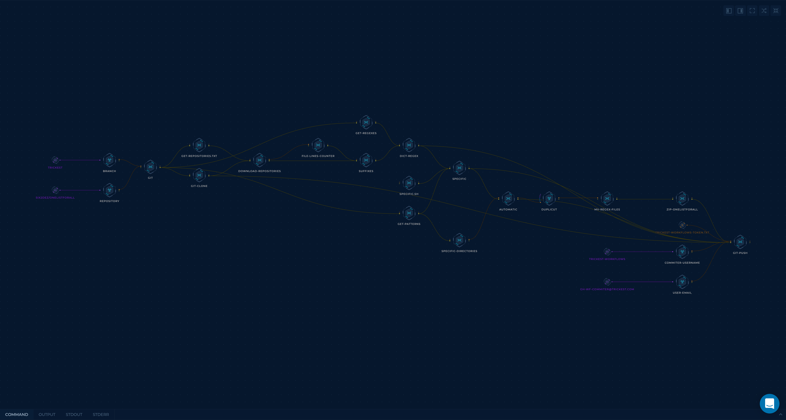

# OneListForAll

## About 

There are a lot of open-source wordlists. This project aims to collect, organize, merge, and constantly update these wordlists, so they can be used in the most effective way. Shouts out to everyone contributing to open-source content!

## How it works

[Trickest](https://trickest.com) Workflow used:



### TB; DZ (Too big; didn't zoom):
- Download wordlists from the repositories listed in `repositories.txt`.
- Download all previous dict files (they could be uploaded manually).
- Grep all wordlists with regexes taken from [clean_wordlist](https://github.com/BonJarber/SecUtils/tree/master/clean_wordlist). Thanks [@BonJarber](https://github.com/BonJarber/)!
- Add the suffix `short` or `long` to each wordlist based on its length.
- Categorize wordlists into `specific` technologies based on the patterns defined in `patterns.txt`.
- Merge and deduplicate wordlists in each `specific` folder.
- Create `short` and `long` versions of each `specific` wordlist.
- Deduplicate ```onelistforall.txt``` with [duplicut](https://github.com/nil0x42/duplicut)! Thanks [nil0x42](https://github.com/nil0x42)!
- Push all to this repository!


## Usage

### Automatic

How to use the automatic wordlists as input into different arrange of the tools.

#### Long

```bash
zip -F automatic/onelistforall.zip --out onelistforall-final.zip
unzip onelistforall-final.zip 
ffuf -c -w automatic/onelistforall.txt -u [target.com]/FUZZ
```

#### Short

```bash
ffuf -c -w automatic/onelistforshort.txt -u [target.com]/FUZZ
```

### Specific

How to use specific wordlists as input into different arrange of the tools.

#### Long

```bash
ffuf -c -w automatic/wordpress_long.txt -u [target.com]/FUZZ
```

#### Short

```bash
ffuf -c -w automatic/wordpress_short.txt -u [target.com]/FUZZ
```

## Sources

- [IntruderPayloads](https://github.com/1N3/IntruderPayloads.git)
- [PayloadsAllTheThings](https://github.com/swisskyrepo/PayloadsAllTheThings.git)
- [SecLists](https://github.com/danielmiessler/SecLists.git)
